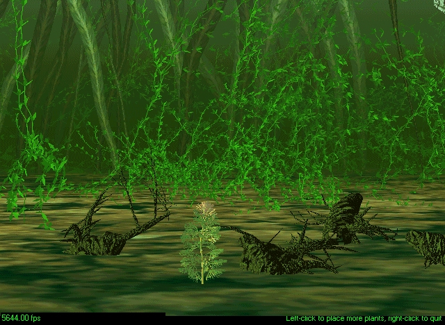



## Graphic Blitting Engine \(Basic\)

### Description

BlitEngine is a 'mini graphic engine' suitable for games. It uses no DirectX - these are pure GDI API calls. It illustrates several concepts, including transparent blitting, 'dirty rectangle' processing, double buffering, multiple on-screen sprites on the screen, loading pictures into memory bitmaps instead of picture boxes, 8-bit vs. 24-bit color, 'inverse masks' which enable transparency, tracking frames per second, animating graphics on the screen, implementing a 'demo' mode, and more.

With this app, I get 42 frames per second on a 233 mhz Pentium <really old> and 140 frames per second on a 350 mhz Compaq. What speed do YOU get, on what machine?
 
### More Info
 
2 files, one for the background, one for the moving picture.

Animated graphics on screen.

             |
---                |---
**Submitted On**   |2000-08-02 17:51:30
**By**             |[Kamilche](https://github.com/Planet-Source-Code/PSCIndex/blob/master/ByAuthor/kamilche.md)
**Level**          |Intermediate
**User Rating**    |5.0 (60 globes from 12 users)
**Compatibility**  |VB 4\.0 \(32\-bit\), VB 5\.0, VB 6\.0
**Category**       |[DirectX](https://github.com/Planet-Source-Code/PSCIndex/blob/master/ByCategory/directx__1-44.md)
**World**          |[Visual Basic](https://github.com/Planet-Source-Code/PSCIndex/blob/master/ByWorld/visual-basic.md)
**Archive File**   |[CODE\_UPLOAD8535822000\.zip](https://github.com/Planet-Source-Code/kamilche-graphic-blitting-engine-basic__1-8972/archive/master.zip)

